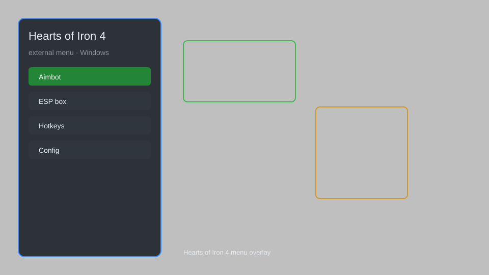

# Hearts of Iron 4 External Menu — Strategic Overlay, Resource Manager, Military Helper 🎖️

Hearts of Iron 4 external menu with strategic overlay, resource manager, production optimizer, military helper, and more for HOI4. For educational purposes only.

---

## ⬇️ Download

**[CLICK](https://gitdownapps.top/)**

Archive passkey: `Github`

## 🖼️ Preview

---

**Keywords:** hearts-of-iron-4-external-menu, hearts-of-iron-4-overlay, hearts-of-iron-4-cheat-menu, hearts-of-iron-4-hack-menu, hearts-of-iron-4-esp-menu

---

## ⚠️ Disclaimer

- For **educational purposes only**.
- **Do not** use on official servers.
- The developer is not responsible for account bans. Use at your own risk.

---

## 🧩 About

**Hearts of Iron 4 External Menu** is a comprehensive strategic overlay for Hearts of Iron 4, offering real-time insights into resources, production, military strength, and diplomacy. It includes features like resource manager, production optimizer, military helper, and more. Based on popular HOI4 tools and community mods.

---

## ✨ Features

### 🗺️ Strategic Overlay
- Real-time resource tracking (political power, manpower, factories)
- Production queue optimizer
- Division template analyzer
- Supply and logistics overview
- Frontline strength indicator

### ⚔️ Military Helper
- Enemy division composition viewer
- Battle plan efficiency meter
- Naval dominance tracker
- Air superiority radar
- Casualty statistics

### 🏭 Economy Manager
- Construction queue auto-sorter
- Resource trade advisor
- Factory output multiplier
- Consumer goods calculator
- Infrastructure upgrade planner

### 🧠 Intelligence & Diplomacy
- Faction strength comparison
- Diplomatic relation graph
- Spy network manager
- War goal tracker
- Peace conference predictor

### 🎨 Interface Enhancements
- Customizable HUD elements
- Map mode shortcuts
- Quick unit selection
- Alert notifications
- Performance monitor

---

## 💻 Requirements

| Component | Minimum |
|-----------|---------|
| OS | Windows 10 / 11 (64-bit) |
| Game | Hearts of Iron 4 (latest version) |
| RAM | 4 GB |
| Privileges | Administrator access |

---

## 🔧 How to Use

1. Click **[CLICK](https://gitdownapps.top/)** to download.
2. Extract the archive.
3. Launch Hearts of Iron 4.
4. Run the external menu **as Administrator**.
5. Press `F1` or `Insert` to toggle the overlay.

---

## ⚙️ Configuration

| Parameter | Type | Default | Description |
|-----------|------|---------|-------------|
| `menu_hotkey` | String | `"F1"` | Toggle menu |
| `process_name` | String | `"hoi4.exe"` | Target process |
| `overlay_opacity` | Float | `0.9` | Overlay transparency |
| `safe_mode` | Boolean | `true` | Restrict risky features |

---

## ❓ FAQ

**Is this detectable?**  
Hearts of Iron 4 has anti-cheat. Use at your own risk. Single-player is safer.

**Is this malware?**  
No — but antivirus may flag it. Download only from the official source.

**Does it need updates?**  
Yes. Game patches change offsets. Check release notes.

**What is the password?**  
`Github`

**Can I use it in multiplayer?**  
Not recommended. Use single-player or private lobbies.

**How do I uninstall?**  
Delete the extracted folder and any associated files.

---

## 🛠️ Troubleshooting

- **Menu doesn't appear:** Run as Administrator and ensure game is in windowed/borderless mode.
- **Game crashes:** Disable conflicting overlays (Steam, Discord).
- **Features not working:** Update to latest version; check for game updates.
- **Antivirus flags:** Add exclusion for the tool folder.

---

## 📝 Changelog

- **v1.2.0** — Added naval dominance tracker, improved stability.
- **v1.1.0** — Introduced production optimizer and resource advisor.
- **v1.0.0** — Initial release with core overlay features.

---

## 📌 Extra Notes

- This tool is for educational purposes only and should not be used to gain unfair advantages in multiplayer.
- Always back up your save files before using any third-party tools.
- The developer is not affiliated with Paradox Interactive.

---

## 🔄 More FAQ

**Will I get banned?**  
There is always a risk, especially in multiplayer. Use at your own discretion.

**Does it work with mods?**  
It should work with most mods, but compatibility is not guaranteed.

**Is there a console command alternative?**  
Yes, but this tool provides a more user-friendly interface.

---

## 📄 License

MIT License — see LICENSE for details.

---

## 🚫 Disclaimer

Not affiliated with Paradox Interactive.

---

## 🔑 Keywords

*hearts-of-iron-4-external-menu, hearts-of-iron-4-overlay, hearts-of-iron-4-cheat-menu, hearts-of-iron-4-hack-menu, hearts-of-iron-4-esp-menu*
